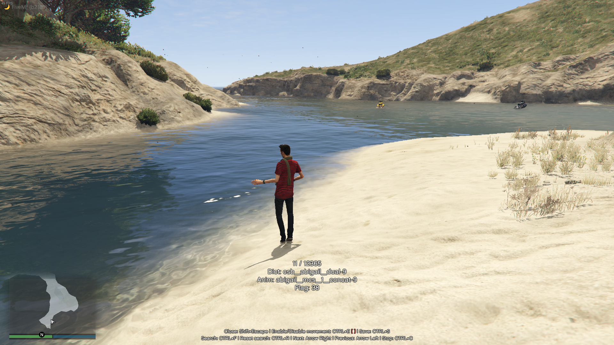
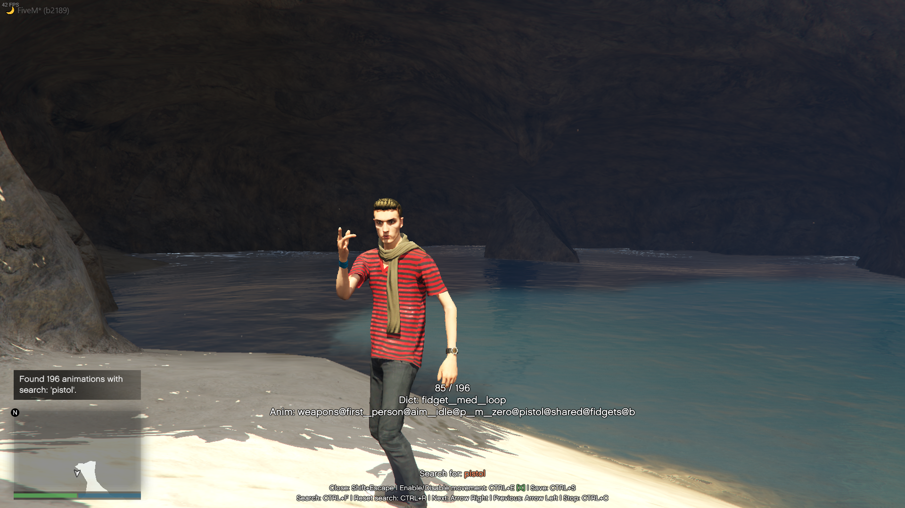
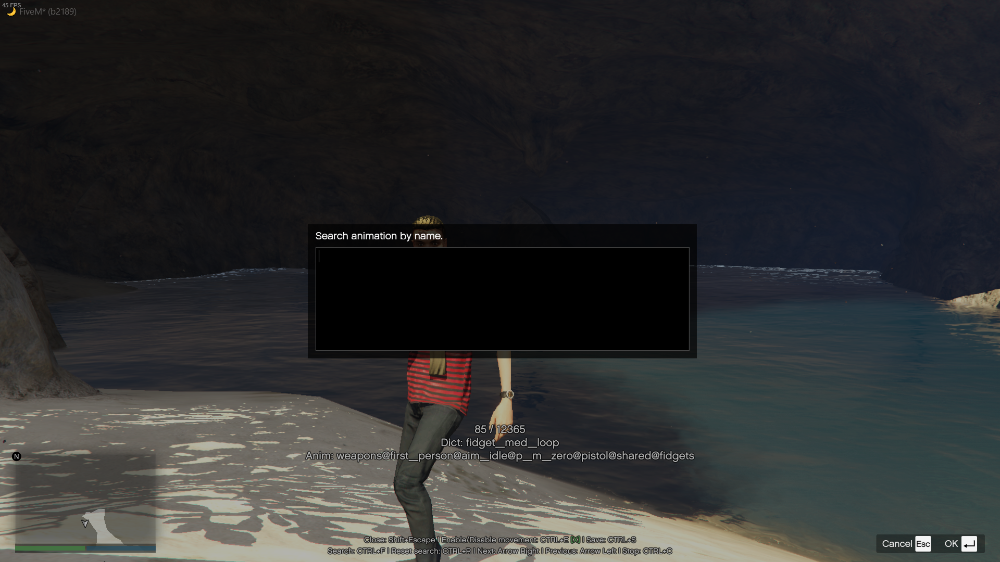

# Animation Viewer

- [Animation Viewer](#animation-viewer)
  - [I have a question. (DISCORD)](#i-have-a-question-discord)
  - [About](#about)
  - [Features](#features)
  - [Installation](#installation)
  - [More images](#more-images)

## [I have a question. (DISCORD)](https://discord.gg/zRnrHuPCYZ)

## About

Simple animation viewer for FiveM server developers.

Script is written in Typescript which is compiled to Javascript, you can open the Animation Viewer menu by triggering a clientside event.

## Features
* Easy to use.
* Search animations by keywords. (you can add more keywords than one, example: prop + sit and any other)
* Change animation flag(s)
* Enable or disable player movement.
* More basic things, nothing complex.

## Installation
Your files are already compiled, so you will not need to compile the Typescript files after downloading the Git repo.

The Typescript source-files are fully opened, you can modify and adjust things as you wish.

## More images

